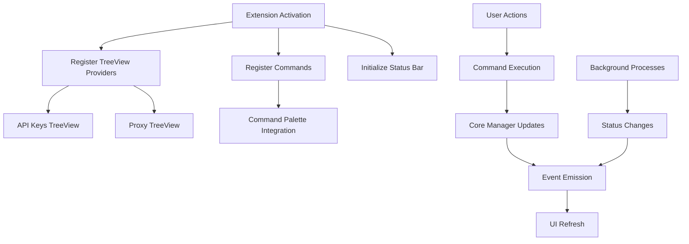

# Design Document

## Overview

This design outlines the transformation of the current React-based webview UI to a native VS Code extension interface. The new design leverages VS Code's built-in UI components including TreeView, QuickPick, StatusBar, and Command Palette to provide a seamless, integrated experience that works across all VS Code environments including remote development scenarios.

## Architecture

### High-Level Architecture

The native UI system will be built around VS Code's extension API with the following key components:

1. **TreeView Provider System**: Custom TreeDataProvider implementations for API keys and proxy management
2. **Command System**: Comprehensive command palette integration with all extension functionality
3. **Status Management**: Real-time status updates through StatusBar and notifications
4. **Event-Driven Updates**: Reactive UI updates based on internal state changes

### Component Interaction Flow



## Components and Interfaces

### 1. TreeView System

#### API Keys TreeView Provider

```typescript
interface ApiKeyTreeItem extends vscode.TreeItem {
  contextValue: 'apiKey' | 'apiKeyGroup';
  keyId?: string;
  status?: 'active' | 'inactive' | 'error';
  usage?: {
    requests: number;
    rateLimit: number;
  };
}

class ApiKeyTreeProvider implements vscode.TreeDataProvider<ApiKeyTreeItem> {
  private _onDidChangeTreeData: vscode.EventEmitter<ApiKeyTreeItem | undefined>;
  readonly onDidChangeTreeData: vscode.Event<ApiKeyTreeItem | undefined>;
  
  getTreeItem(element: ApiKeyTreeItem): vscode.TreeItem;
  getChildren(element?: ApiKeyTreeItem): Thenable<ApiKeyTreeItem[]>;
  refresh(): void;
}
```

#### Proxy TreeView Provider

```typescript
interface ProxyTreeItem extends vscode.TreeItem {
  contextValue: 'proxy' | 'proxyGroup';
  proxyId?: string;
  health?: 'healthy' | 'unhealthy' | 'checking';
  assignedKeys?: string[];
}

class ProxyTreeProvider implements vscode.TreeDataProvider<ProxyTreeItem> {
  private _onDidChangeTreeData: vscode.EventEmitter<ProxyTreeItem | undefined>;
  readonly onDidChangeTreeData: vscode.Event<ProxyTreeItem | undefined>;
  
  getTreeItem(element: ProxyTreeItem): vscode.TreeItem;
  getChildren(element?: ProxyTreeItem): Thenable<ProxyTreeItem[]>;
  refresh(): void;
}
```

### 2. Command System

#### Command Registration

```typescript
interface ExtensionCommands {
  // API Key Management
  'gemini-proxy.addApiKey': () => Promise<void>;
  'gemini-proxy.removeApiKey': (keyId: string) => Promise<void>;
  'gemini-proxy.viewApiKeyDetails': (keyId: string) => Promise<void>;
  'gemini-proxy.testApiKey': (keyId: string) => Promise<void>;
  
  // Proxy Management
  'gemini-proxy.addProxy': () => Promise<void>;
  'gemini-proxy.removeProxy': (proxyId: string) => Promise<void>;
  'gemini-proxy.testProxy': (proxyId: string) => Promise<void>;
  'gemini-proxy.assignProxy': (keyId: string) => Promise<void>;
  
  // Server Control
  'gemini-proxy.startServer': () => Promise<void>;
  'gemini-proxy.stopServer': () => Promise<void>;
  'gemini-proxy.restartServer': () => Promise<void>;
  
  // Utilities
  'gemini-proxy.refreshAll': () => Promise<void>;
  'gemini-proxy.showLogs': () => Promise<void>;
  'gemini-proxy.exportConfig': () => Promise<void>;
}
```

### 3. Status Bar Integration

#### Status Bar Manager

```typescript
class StatusBarManager {
  private serverStatusItem: vscode.StatusBarItem;
  private requestCountItem: vscode.StatusBarItem;
  private healthStatusItem: vscode.StatusBarItem;
  
  updateServerStatus(status: 'running' | 'stopped' | 'error'): void;
  updateRequestCount(count: number): void;
  updateHealthStatus(healthy: number, total: number): void;
  show(): void;
  hide(): void;
}
```

### 4. Input and Dialog System

#### Input Handlers

```typescript
class InputManager {
  async promptForApiKey(): Promise<string | undefined>;
  async promptForProxyConfig(): Promise<ProxyConfig | undefined>;
  async confirmDeletion(itemName: string): Promise<boolean>;
  async selectFromList<T>(items: T[], placeHolder: string): Promise<T | undefined>;
}
```

## Data Models

### TreeView Data Models

#### API Key Tree Structure

```typescript
interface ApiKeyTreeData {
  id: string;
  label: string;
  description?: string;
  iconPath?: vscode.ThemeIcon;
  collapsibleState?: vscode.TreeItemCollapsibleState;
  contextValue: string;
  command?: vscode.Command;
  tooltip?: string;
  resourceUri?: vscode.Uri;
}
```

#### Proxy Tree Structure

```typescript
interface ProxyTreeData {
  id: string;
  label: string;
  description?: string;
  iconPath?: vscode.ThemeIcon;
  collapsibleState?: vscode.TreeItemCollapsibleState;
  contextValue: string;
  command?: vscode.Command;
  tooltip?: string;
}
```

### State Management

#### UI State Interface

```typescript
interface UIState {
  apiKeys: Map<string, ApiKeyUIData>;
  proxies: Map<string, ProxyUIData>;
  serverStatus: ServerStatus;
  lastUpdate: Date;
}

interface ApiKeyUIData {
  id: string;
  name: string;
  status: 'active' | 'inactive' | 'error';
  usage: UsageStats;
  assignedProxy?: string;
}

interface ProxyUIData {
  id: string;
  name: string;
  health: 'healthy' | 'unhealthy' | 'checking';
  assignedKeys: string[];
  lastCheck: Date;
}
```

## Error Handling

### Error Display Strategy

1. **Critical Errors**: Use `vscode.window.showErrorMessage()` with action buttons
2. **Warnings**: Use `vscode.window.showWarningMessage()` for non-critical issues
3. **Information**: Use `vscode.window.showInformationMessage()` for status updates
4. **Progress**: Use `vscode.window.withProgress()` for long-running operations

### Error Recovery

```typescript
class ErrorHandler {
  async handleApiKeyError(error: Error, keyId: string): Promise<void>;
  async handleProxyError(error: Error, proxyId: string): Promise<void>;
  async handleServerError(error: Error): Promise<void>;
  
  private async showErrorWithActions(
    message: string, 
    actions: string[]
  ): Promise<string | undefined>;
}
```

## Testing Strategy

### Unit Testing

1. **TreeView Providers**: Test data transformation and tree structure
2. **Command Handlers**: Test command execution and error handling
3. **Status Bar Manager**: Test status updates and display logic
4. **Input Manager**: Test input validation and user interaction flows

### Integration Testing

1. **Extension Activation**: Test complete UI initialization
2. **Command Integration**: Test command palette functionality
3. **Event Flow**: Test UI updates in response to core system changes
4. **Remote Environment**: Test functionality in Codespaces and Remote SSH

### Testing Framework

```typescript
// Test structure for TreeView providers
describe('ApiKeyTreeProvider', () => {
  let provider: ApiKeyTreeProvider;
  let mockApiKeyManager: jest.Mocked<ApiKeyManager>;
  
  beforeEach(() => {
    mockApiKeyManager = createMockApiKeyManager();
    provider = new ApiKeyTreeProvider(mockApiKeyManager);
  });
  
  it('should return correct tree items for API keys', async () => {
    // Test implementation
  });
  
  it('should refresh tree when API keys change', async () => {
    // Test implementation
  });
});
```

### Performance Considerations

1. **Lazy Loading**: TreeView items loaded on-demand
2. **Debounced Updates**: Prevent excessive UI refreshes
3. **Memory Management**: Proper disposal of event listeners
4. **Caching**: Cache tree data to reduce computation

### Migration Strategy

1. **Phase 1**: Implement TreeView providers alongside existing webview
2. **Phase 2**: Add command palette integration
3. **Phase 3**: Implement status bar integration
4. **Phase 4**: Remove webview dependencies
5. **Phase 5**: Clean up unused webview code

### Accessibility Compliance

1. **Screen Reader Support**: Proper ARIA labels and descriptions
2. **Keyboard Navigation**: Full keyboard accessibility for all UI components
3. **High Contrast**: Support for high contrast themes
4. **Focus Management**: Proper focus handling in TreeViews and dialogs

### Theme Integration

1. **Icon Consistency**: Use VS Code's built-in ThemeIcon system
2. **Color Adaptation**: Respect VS Code's color theme
3. **Font Scaling**: Support VS Code's font size settings
4. **Dark/Light Mode**: Automatic adaptation to theme changes
