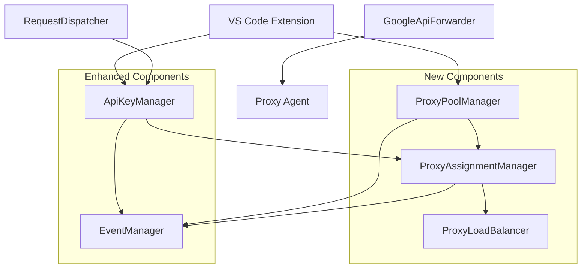

# Design Document

## Overview

The proxy-per-API-key feature enhances the existing Gemini API Key Aggregator by implementing dedicated proxy assignment for each API key. This design builds upon the current architecture while adding robust proxy management, automatic assignment, and load balancing capabilities.

The system will maintain a pool of proxy servers and intelligently assign them to API keys, ensuring optimal distribution and persistent assignments across extension restarts.

## Architecture

### Current Architecture Analysis

The existing system consists of:
- **ApiKeyManager**: Manages API key lifecycle, status, and selection
- **RequestDispatcher**: Handles API key selection for requests
- **GoogleApiForwarder**: Forwards requests to Google's API with proxy support
- **EventManager**: Manages real-time updates and notifications
- **VS Code Extension**: Provides UI and persistent storage via SecretStorage

### Enhanced Architecture

The enhanced system will add:
- **ProxyPoolManager**: Manages the pool of available proxy servers
- **ProxyAssignmentManager**: Handles automatic and manual proxy assignments
- **ProxyLoadBalancer**: Distributes API keys across proxies optimally
- Enhanced **ApiKeyManager**: Extended with proxy assignment persistence



## Components and Interfaces

### ProxyPoolManager

Manages the collection of available proxy servers and their health status.

```typescript
interface ProxyServer {
  id: string;
  url: string;
  status: 'active' | 'inactive' | 'error';
  assignedKeyCount: number;
  lastHealthCheck?: number;
  errorCount: number;
}

class ProxyPoolManager {
  private proxies: Map<string, ProxyServer>;
  private healthCheckInterval: NodeJS.Timeout;
  
  async addProxy(url: string): Promise<string>;
  async removeProxy(id: string): Promise<void>;
  async updateProxy(id: string, url: string): Promise<void>;
  getAvailableProxies(): ProxyServer[];
  async validateProxyUrl(url: string): Promise<boolean>;
  private async performHealthCheck(): Promise<void>;
}
```

### ProxyAssignmentManager

Handles the assignment logic between API keys and proxy servers.

```typescript
interface ProxyAssignment {
  keyId: string;
  proxyId: string;
  assignedAt: number;
  isManual: boolean;
}

class ProxyAssignmentManager {
  private assignments: Map<string, ProxyAssignment>;
  
  async assignProxyToKey(keyId: string, proxyId?: string): Promise<void>;
  async unassignProxy(keyId: string): Promise<void>;
  async reassignProxy(keyId: string, newProxyId: string): Promise<void>;
  getAssignmentForKey(keyId: string): ProxyAssignment | null;
  async rebalanceAssignments(): Promise<void>;
  private async persistAssignments(): Promise<void>;
}
```

### ProxyLoadBalancer

Implements load balancing strategies for optimal proxy distribution.

```typescript
interface LoadBalancingStrategy {
  selectProxyForNewKey(availableProxies: ProxyServer[]): ProxyServer | null;
  shouldRebalance(assignments: ProxyAssignment[], proxies: ProxyServer[]): boolean;
}

class ProxyLoadBalancer {
  private strategy: LoadBalancingStrategy;
  
  selectOptimalProxy(availableProxies: ProxyServer[]): ProxyServer | null;
  calculateProxyLoad(proxyId: string): number;
  generateRebalancePlan(assignments: ProxyAssignment[], proxies: ProxyServer[]): RebalancePlan;
}
```

### Enhanced ApiKey Interface

```typescript
interface ApiKey {
  key: string;
  keyId: string;
  status: 'available' | 'cooling_down' | 'disabled';
  coolingDownUntil?: number;
  currentRequests: number;
  lastUsed?: number;
  usedHistory?: { date: number; rate: number; serverCurrentTime?: number }[];
  // Enhanced proxy fields
  assignedProxyId?: string;
  proxyAssignedAt?: number;
  proxyUrl?: string; // Computed field for backward compatibility
}
```

## Data Models

### Persistent Storage Schema

The system will use VS Code's SecretStorage for persistence:

```typescript
// Proxy pool storage
interface StoredProxyPool {
  proxies: {
    id: string;
    url: string;
    status: string;
    errorCount: number;
  }[];
  lastUpdated: number;
}

// Proxy assignments storage
interface StoredProxyAssignments {
  assignments: {
    keyId: string;
    proxyId: string;
    assignedAt: number;
    isManual: boolean;
  }[];
  lastUpdated: number;
}

// Storage keys
const STORAGE_KEYS = {
  PROXY_POOL: 'geminiProxyPool',
  PROXY_ASSIGNMENTS: 'geminiProxyAssignments',
  PROXY_SETTINGS: 'geminiProxySettings'
};
```

### Configuration Model

```typescript
interface ProxyConfiguration {
  autoAssignmentEnabled: boolean;
  loadBalancingStrategy: 'round_robin' | 'least_loaded' | 'random';
  healthCheckInterval: number;
  maxErrorsBeforeDisable: number;
  rebalanceThreshold: number;
}
```

## Error Handling

### Proxy-Specific Error Handling

1. **Proxy Connection Errors**
   - Increment error count for the proxy
   - Temporarily disable proxy if error threshold exceeded
   - Attempt request without proxy as fallback
   - Log detailed error information for debugging

2. **Proxy Assignment Errors**
   - Validate proxy availability before assignment
   - Rollback assignment on failure
   - Emit events for UI updates
   - Maintain assignment consistency

3. **Load Balancing Errors**
   - Handle cases where no proxies are available
   - Graceful degradation to direct connections
   - Prevent infinite rebalancing loops
   - Log rebalancing decisions

### Error Recovery Strategies

```typescript
class ProxyErrorHandler {
  async handleProxyError(proxyId: string, error: Error): Promise<void>;
  async handleAssignmentError(keyId: string, proxyId: string, error: Error): Promise<void>;
  async recoverFromProxyFailure(keyId: string): Promise<void>;
}
```

## Testing Strategy

### Unit Testing

1. **ProxyPoolManager Tests**
   - Proxy addition, removal, and validation
   - Health check functionality
   - Error handling and recovery

2. **ProxyAssignmentManager Tests**
   - Assignment logic correctness
   - Persistence and recovery
   - Manual vs automatic assignments

3. **ProxyLoadBalancer Tests**
   - Load balancing algorithm accuracy
   - Rebalancing trigger conditions
   - Strategy pattern implementation

### Integration Testing

1. **End-to-End Proxy Flow**
   - API key creation with automatic proxy assignment
   - Request routing through assigned proxies
   - Proxy failure and recovery scenarios

2. **Persistence Testing**
   - Assignment persistence across extension restarts
   - Data migration and compatibility
   - Concurrent access handling

3. **UI Integration Testing**
   - Real-time updates in management panel
   - Manual proxy reassignment workflows
   - Error state display and handling

### Performance Testing

1. **Load Distribution Testing**
   - Verify even distribution across proxies
   - Test rebalancing performance impact
   - Measure assignment lookup performance

2. **Concurrent Request Testing**
   - Multiple simultaneous requests through different proxies
   - Proxy pool modification during active requests
   - Resource cleanup and memory management

## Implementation Phases

### Phase 1: Core Infrastructure
- Implement ProxyPoolManager with basic CRUD operations
- Add proxy validation and health checking
- Extend ApiKey interface and storage schema

### Phase 2: Assignment Logic
- Implement ProxyAssignmentManager
- Add automatic assignment on key creation
- Implement persistence layer for assignments

### Phase 3: Load Balancing
- Implement ProxyLoadBalancer with round-robin strategy
- Add rebalancing logic and triggers
- Implement manual reassignment capabilities

### Phase 4: UI Integration
- Update management panel to display proxy assignments
- Add proxy management interface
- Implement real-time updates via EventManager

### Phase 5: Advanced Features
- Add additional load balancing strategies
- Implement proxy health monitoring
- Add comprehensive error handling and recovery

## Backward Compatibility

The design maintains backward compatibility with the existing system:

1. **Existing API Key Storage**: Current API keys will continue to work without assigned proxies
2. **Request Flow**: Requests without proxy assignments will use the existing direct connection logic
3. **Configuration**: Existing proxy configuration (rotating proxy) will be migrated to the new system
4. **UI Components**: Current UI components will be enhanced rather than replaced

## Security Considerations

1. **Proxy URL Validation**: Strict validation of proxy URLs to prevent injection attacks
2. **Credential Storage**: Proxy credentials (if any) stored securely using VS Code SecretStorage
3. **Connection Security**: Ensure HTTPS proxies are preferred and validated
4. **Error Information**: Sanitize error messages to prevent information leakage